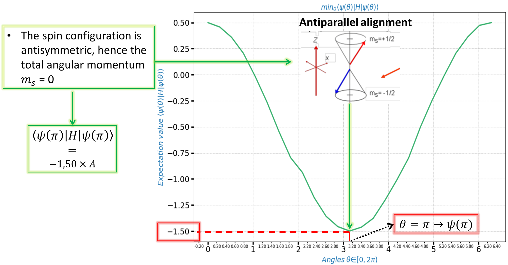

# VQE
I Used the Variational Quantum Eigensolver (VQE) to find the ground state of a two 1/2 spins hamiltonian which describe their interaction, [see it here](https://github.com/walid-mk/VQE/blob/master/Task4/VQE.Noiseless.Simulator.Code1.ipynb).

